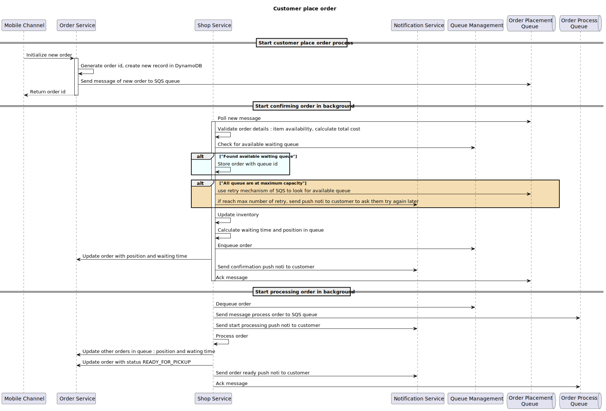

# Technical Assessment - Global Coffee Shop

## Part 1 : Solution Design

### Process Flow


### [API Contract](api_contract.pdf)

### Secured coding
- **Authentication** : JWT token - After successfully login, user will be issued an JWT, which will be 
included in subsequent requests
- **Authorization** : JWT contain roles information for access control decisions on the resource. In this
case, there are 2 roles : shop admin and shop operator, and only admin can access url : /config
- **IDOR** (Insecure Direct Object References) : JWT also contain the **profileId** to detect user 
and only retrieve, perform actions on resources belong to that user
- **Key identifier** : such as shop-id, order-id is UUID, which is hard to guess
- **Rate limit** : to limit the number of time user can use the function
- **Log masking** : Mask all sensitive info (username, phone number, account number) to protect customer
personal data

### Testing
- **Unit Test** (Mockito) : test classes, methods to ensure they perform the expected function
- **Component test** (Cucumber) : BDD (behavior-driven development) testing for application's behavior
- **Penetration test** : Test authorization logic, input validation, etc.
- **Load test** : Simulate high traffic under expected load to measure the system performance
- **Stress test** : Test the limit of the system to identify bottlenecks

### Architecture
- **Micro-service** :
  - Customer Service : Registration and authentication for customers
  - Order Service : Handle order requests from customer
  - Shop service : Store menu, pricing and item counts; Handle actions from shop owners; Manage queues
  - Notification service : send notification to customers and shop owners
  - Payment service : integrate with third-parties like payment gateway
- **Event-driven** : allow components do asynchronous communication with each other,
real-time processing using AWS MSK (Kafka) or DynamoDB Stream + EventBridge
- **Reactive** : Distributed master data (profile) into multiple consuming service to reduce latency,
tight coupling
- **Serverless** : utilize AWS managed services like ECS, EventBridge, DynamoDB, SNS, etc. for high availability,
reduce operational overhead, focus on business


### Infrastructure (AWS)


- Because requirements state that the coffee shop application is global, the solution is built for
**Multi-Tenant** using **Pool Model** with [Configuration Driven Development (CDD)](https://www.agilelonestar.com/knowledge-base/cdd)
- **Components**:
  - Routers: (HTTP Proxy and EventBridge Pipes/Bus) based on **TenantId** to route request (HTTP, events)
  to corresponding Tenant AWS account
  - Configuration Enricher : enrich request with specific Tenant metadata, configuration stored in Parameter Store,
  DynamoDB, etc.


## Part 2 : Implement Process Order Service
## Overview
The Coffee Shop REST API is a Spring Boot and Gradle-based web service that manages coffee pre-orders. The API is documented using Springdoc OpenAPI.

## Features

- Enable Shop Owners to pick an order from a queue and process it

## Getting Started

### Prerequisites

- [Java JDK 21](https://docs.aws.amazon.com/corretto/latest/corretto-21-ug/downloads-list.html)
- [Gradle](https://gradle.org/install/)
- Database : PostgreSQL

### Installation

1. **Clone the repository:**

   ```bash
   git clone https://github.com/HoangMac/coffeeshop.git

2. **Navigate to the project directory:**

    ```bash
    cd coffeeshop

3. **Specify Java Home Variable (SDK 21)**

    ```bash
    export JAVA_HOME=~/Library/Java/JavaVirtualMachines/corretto-21.0.2/Contents/Home

4. **Deploy the application:**

  ```bash
  chmod +x deploy.sh stop.sh
  ./deploy.sh
  ```
5. **The application will start on http://localhost:8080.**

### API Documentation
Access the API documentation by navigating to:

http://localhost:8080/swagger-ui.html


